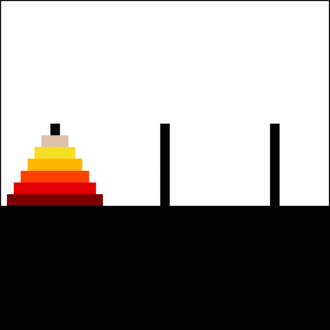

# Tower-of-Hanoi
# Tower-of-Hanoi
### briefly: 

There are three towers. The objective of the game is to move all the disks over to third tower 
but you can't place a larger disk onto a smaller disk. 

for more informations: https://en.wikipedia.org/wiki/Tower_of_Hanoi

and here is a GIF that explain how the actual process looks like:

my solution:
...
